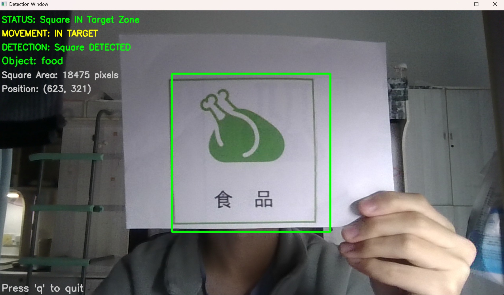
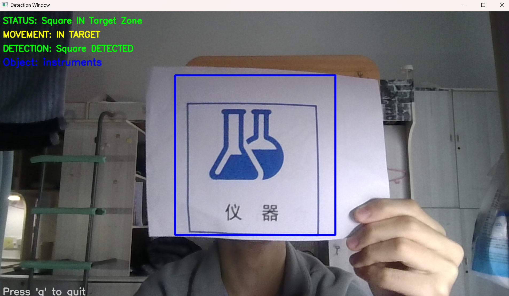
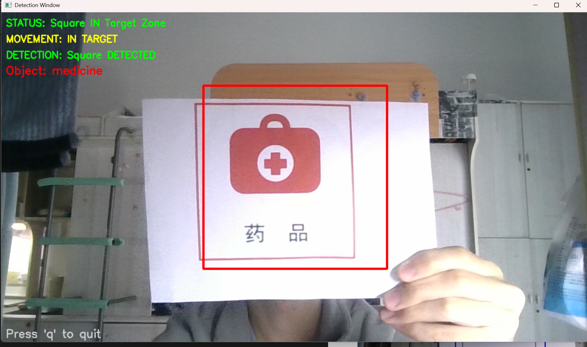
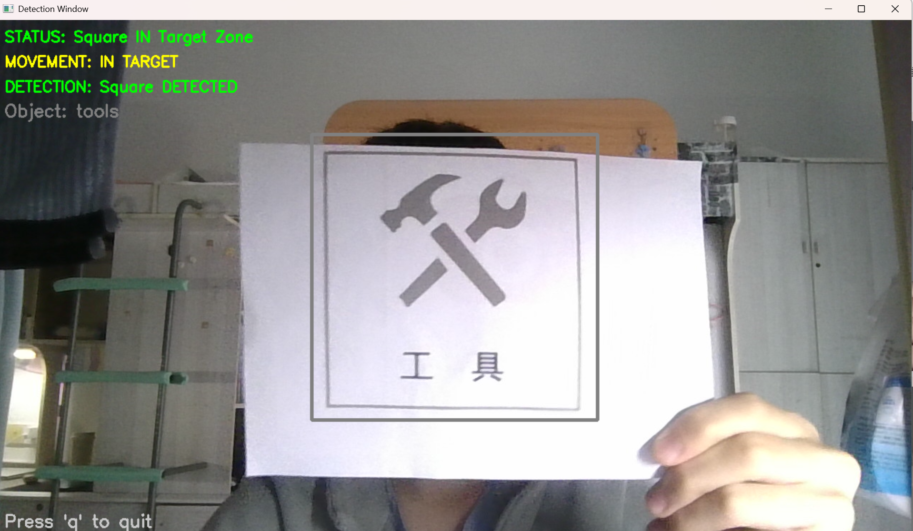

# <center>T2：基于视觉传感器的彩色图片检测系统 - 技术文档</center>

## 目录：
- [一、题目分析](#题目分析)
- [二、设计思路](#设计思路)
- [三、算法设计](#算法设计)
- [四、迭代历程](#迭代历程)


## 题目分析
先来看题设的四张图，它们的特征是：
- 1.具有明显的颜色区别
- 2.外侧有有色方框

由此，我们的检测思路似乎可以通过识别具体颜色判断图片类型，通过方框判断是否在识别区内

我们的目标是：
- 基本要求：能够检测是否在区域内；
- 进阶要求：能够识别出在规定的框内的是什么图案。
- 该题得分依次为：
  - 识别出每张照片的图案；
  - 识别出图案并且对应上；
  - 系统鲁棒性足够好，能够用现实摄像头进行识别

因此，我们需要实现以下功能：
- 在屏幕中心绘制一个正方形区域作为目标放置区，并实时检测特定正方形图案是否位于该区域内。

这可以拆分为以下三大功能：
- 摄像头初始化与调用
- 可视化区域标记
- 实时图案识别与位置判断

## 设计思路
由上，经过思考，我们可以得到如下的处理流程：
```
初始化层: 初始化并调用摄像头
    ↓
预处理层: 绘制检测框 → 添加参数标签
    ↓
检测层: 颜色阈值 → 掩码生成 → 轮廓提取
    ↓
分析层: 颜色检测 → 轮廓分析 → 评分匹配
    ↓
标注层: 更新参数标签
    ↓
输出层: 可视化显示
```

## 算法设计
接下来，我们就可以进行具体的算法设计了

### 1.初始化层：
#### 1.1 摄像头初始化模块
**功能：** 初始化并配置摄像头设备
**设计：**
- 使用 `cv2.VideoCapture(0)` 打开默认摄像头
- 错误处理：摄像头打开失败时输出错误信息并退出
- 参数设置：分辨率 1280×960，帧率 60 FPS

**实现：**
```python
cap = cv2.VideoCapture(0)
cap.set(cv2.CAP_PROP_FRAME_WIDTH, 1280)
cap.set(cv2.CAP_PROP_FRAME_HEIGHT, 960)
cap.set(cv2.CAP_PROP_FPS, 60)
```

#### 1.2 图案识别器初始化模块
**功能：** 初始化 `PatternRecognizer` 类，定义四种图案的 HSV 颜色范围
**设计：**
- 食品（绿色）：HSV 范围 [25, 30, 30] 到 [95, 255, 255]
- 工具（灰色）：HSV 范围 [0, 0, 110] 到 [180, 25, 150]
- 仪器（蓝色）：HSV 范围 [100, 50, 50] 到 [130, 255, 255]
- 药品（红色）：HSV 范围 [0, 100, 100] 到 [10, 255, 255] 和 [170, 100, 100] 到 [180, 255, 255]（两个范围合并）

**设计理由：**
- 红色在 HSV 中跨越 0°，需要两个范围合并
- 灰色检测范围较窄，避免误识别
- 绿色检测范围较宽，提高识别率

### 2.预处理层：
#### 2.1 颜色空间转换模块
**功能：** 将 BGR 图像转换为 HSV 颜色空间
**设计理由：**
- HSV 鲁棒性强，对光照变化不敏感
- 色相（H）通道独立于亮度和饱和度，更适合颜色识别
- 相比 RGB，HSV 能更准确地定义颜色范围

**实现：**
```python
hsv_frame = cv2.cvtColor(frame, cv2.COLOR_BGR2HSV)
```

#### 2.2 ROI 区域定义模块
**功能：** 在图像中心定义感兴趣区域（ROI）
**设计思路：**
- 计算图像中心点坐标
- 以中心点为对称中心，定义 400×400 像素的正方形 ROI
- 计算 ROI 的四个角点坐标

**实现：**
```python
center_x, center_y = width // 2, height // 2
roi_x1 = center_x - roi_size // 2
roi_y1 = center_y - roi_size // 2
roi_x2 = center_x + roi_size // 2
roi_y2 = center_y + roi_size // 2
```

#### 2.3 ROI 掩码生成模块
**功能：** 创建二值掩码，标记 ROI 区域
**设计思路：**
- 创建与图像同尺寸的全零数组
- 在 ROI 区域内填充 255（白色），ROI 外保持 0（黑色）

**实现：**
```python
roi_mask = np.zeros((height, width), dtype=np.uint8)
cv2.rectangle(roi_mask, (roi_x1, roi_y1), (roi_x2, roi_y2), 255, -1)
```

**优势：**
- 二值掩码便于后续区域限制操作
- 清晰标记检测区域，减少背景干扰

### 3.检测层：
#### 3.1 颜色阈值设计
**设计思路：**
- 为每种图案定义 HSV 上下限范围
- 红色特殊处理：HSV 中红色跨越 0°（0-10° 和 170-180°），需要两个范围合并
- 灰色范围较窄，避免误识别其他颜色

**实现：**
```python
# 食品（绿色）
self.food_lower = np.array([25, 30, 30])
self.food_upper = np.array([95, 255, 255])

# 工具（灰色）
self.tools_lower = np.array([0, 0, 110])
self.tools_upper = np.array([180, 25, 150])

# 仪器（蓝色）
self.instruments_lower = np.array([100, 50, 50])
self.instruments_upper = np.array([130, 255, 255])

# 药品（红色）- 两个范围
self.medicine_lower = np.array([0, 100, 100])
self.medicine_upper = np.array([10, 255, 255])
self.medicine_lower2 = np.array([170, 100, 100])
self.medicine_upper2 = np.array([180, 255, 255])
```

#### 3.2 掩码生成算法
**设计思路：**
- 使用 `cv2.inRange()` 为每种颜色生成二值掩码
- 红色需要合并两个掩码（`cv2.bitwise_or()`）
- 其他颜色直接生成单掩码

**实现：**
```python
mask_food = cv2.inRange(hsv_image, self.food_lower, self.food_upper)
mask_tools = cv2.inRange(hsv_image, self.tools_lower, self.tools_upper)
mask_instruments = cv2.inRange(hsv_image, self.instruments_lower, self.instruments_upper)
mask_medicine1 = cv2.inRange(hsv_image, self.medicine_lower, self.medicine_upper)
mask_medicine2 = cv2.inRange(hsv_image, self.medicine_lower2, self.medicine_upper2)
mask_medicine = cv2.bitwise_or(mask_medicine1, mask_medicine2)
```

**优势：**
- 二值掩码便于后续轮廓提取
- 噪声抑制效果好
- 并行生成四种颜色掩码，效率高

#### 3.3 ROI 区域限制算法
**设计思路：**
- 使用 `cv2.bitwise_and()` 将颜色掩码限制在 ROI 内
- ROI 外的颜色区域被置零，只保留 ROI 内的检测结果

**实现：**
```python
roi_food = cv2.bitwise_and(mask_food, mask_food, mask=roi_mask)
roi_tools = cv2.bitwise_and(mask_tools, mask_tools, mask=roi_mask)
roi_instruments = cv2.bitwise_and(mask_instruments, mask_instruments, mask=roi_mask)
roi_medicine = cv2.bitwise_and(mask_medicine, mask_medicine, mask=roi_mask)
```

**优势：**
- 减少背景干扰
- 提高检测精度
- 减少计算量

### 4.分析层：
#### 4.1 轮廓检测与过滤
**设计思路：**
- 使用 `cv2.findContours()` 提取外部轮廓（`RETR_EXTERNAL`）
- 面积过滤：面积 < 500 像素的轮廓视为噪声，直接跳过
- 对每种颜色的 ROI 掩码分别进行轮廓分析

**实现：**
```python
contours, _ = cv2.findContours(mask, cv2.RETR_EXTERNAL, cv2.CHAIN_APPROX_SIMPLE)
valid_contours = [c for c in contours if cv2.contourArea(c) > min_area]
```

**设计理由：**
- 过滤小面积噪声点
- 提高检测准确性
- 减少无效计算

#### 4.2 特征提取算法
**设计思路：**
- 计算有效轮廓的数量
- 计算所有有效轮廓的平均面积
- 找出最大轮廓
- 计算最大轮廓的重心（使用 `cv2.moments()`）

**实现：**
```python
features['contour_count'] = len(valid_contours)
areas = [cv2.contourArea(c) for c in valid_contours]
features['avg_area'] = np.mean(areas)
largest = max(valid_contours, key=cv2.contourArea)
M = cv2.moments(largest)
cx = int(M['m10'] / M['m00'])
cy = int(M['m01'] / M['m00'])
```

**特征提取：**
- 轮廓数量：`contour_count`
- 平均面积：`avg_area`（像素）
- 最大轮廓：`largest_contour`
- 重心坐标：`centroid` (cx, cy)

#### 4.3 评分计算算法
**设计思路：**
- 为每种图案计算匹配分数
- 分数公式：`分数 = (平均面积 / 10000) + (轮廓数量 × 0.5)`
- 如果轮廓数量为 0，直接返回 0 分

**实现：**
```python
def _calculate_score(self, features):
    if features['contour_count'] == 0:
        return 0
    score = features['avg_area'] / 10000  # 面积分数
    score += features['contour_count'] * 0.5  # 轮廓数量分数
    return score
```

**设计理由：**
- 面积是主要指标，反映目标大小
- 轮廓数量是辅助指标，反映检测可靠性
- 归一化处理（除以 10000）使分数更合理

#### 4.4 最佳匹配选择算法
**设计思路：**
- 对四种图案的分数进行比较
- 选择分数最高的图案作为识别结果
- 返回图案类型、分数、名称和颜色

**实现：**
```python
scores = {
    'food': self._calculate_score(features_food),
    'tools': self._calculate_score(features_tools),
    'instruments': self._calculate_score(features_instruments),
    'medicine': self._calculate_score(features_medicine)
}
best_pattern = max(scores, key=scores.get)
```

**优势：**
- 并行检测四种图案，互不干扰
- 基于分数的客观判断
- 自动选择最佳匹配

### 5.标注层：
#### 5.1 状态信息显示模块
**功能：** 在图像上绘制检测状态信息
**设计：**
- 状态行1：检测状态（"STATUS: Square IN Target Zone"）
- 状态行2：运动状态（"MOVEMENT: IN TARGET" 或 "NO SQUARE DETECTED"）
- 状态行3：检测结果（"DETECTION: Square DETECTED" 或 "NOT DETECTED"）
- 状态行4：识别的物品名称（"Object: food/tools/instruments/medicine"）
- 状态行5：面积信息（"Square Area: XXX pixels"）
- 状态行6：位置信息（"Position: (x, y)"）

**实现：**
```python
cv2.putText(frame, status_text, (10, 30), cv2.FONT_HERSHEY_SIMPLEX, 0.7, status_color, 2)
```

#### 5.2 ROI 框绘制模块
**功能：** 在图像上绘制 ROI 区域框
**设计：**
- 检测到目标：使用图案颜色绘制 ROI 框（线宽 3）
- 未检测到：使用绿色绘制 ROI 框（线宽 2）

**实现：**
```python
if square_detected:
    cv2.rectangle(frame, (roi_x1, roi_y1), (roi_x2, roi_y2), pattern_color, 3)
else:
    cv2.rectangle(frame, (roi_x1, roi_y1), (roi_x2, roi_y2), (0, 255, 0), 2)
```

### 6.输出层：
#### 6.1 实时视频显示模块
**功能：** 实时显示检测结果窗口
**设计：**
- 使用 `cv2.imshow()` 显示处理后的图像帧
- 窗口标题："Detection Window"
- 按键处理：按 'q' 键退出程序

**实现：**
```python
cv2.imshow("Detection Window", frame)
key = cv2.waitKey(1) & 0xFF
if key == ord('q'):
    break
```

#### 6.2 资源释放模块
**功能：** 释放摄像头资源并关闭窗口
**设计：**
- 释放摄像头：`cap.release()`
- 关闭所有窗口：`cv2.destroyAllWindows()`

**实现：**
```python
cap.release()
cv2.destroyAllWindows()
```

## 迭代历程
< 三、算法设计 > 中的模块是最终成果，这之中经历了多轮迭代过程
并且由于我们是先做的T3，所以很多踩过的坑可以直接避免了，大大节省了试错时间

#### 迭代1：
我们要先实现基本要求，进阶要求可以在之后的迭代中逐步实现，因此，在迭代一中，我们编写了识别物体是否位于中央的相关算法
- 如图：


但是，存在识别度低且易误识别的问题

#### 迭代2：
在询问了AI后，改进了算法，使用一套**分数体系**作为评判标准，提高了判断准确度（标准分通过调试获得，当图片进入ROI框大致超过一半时可以识别）
- 如图：





但是，灰色图案识别率过高，绿色则过低

#### 迭代3：
调整了HSV范围，使灰色检测更苛刻，绿色检测更宽松