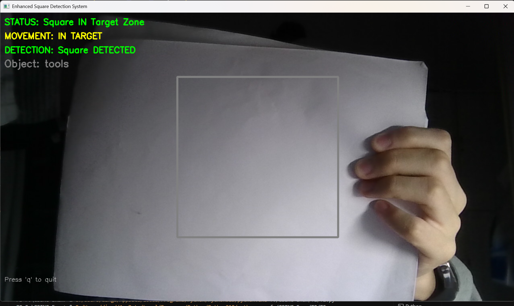

# <center>T2：基于视觉传感器的彩色图片检测系统 - 技术文档</center>

## 目录：
- [一、题目分析](#题目分析)
- [二、设计思路](#设计思路)
- [三、算法设计](#算法设计)
- [四、迭代历程](#迭代历程)


## 题目分析
先来看题设的四张图，它们的特征是：
- 1.具有明显的颜色区别
- 2.外侧有有色方框

由此，我们的检测思路似乎可以是先通过掩码识别外围方框，再通过识别具体颜色判断图片类型

附录：
1) 食品箱标识贴及归位区的 RGB：117，189，66
2) 工具箱标识贴及归位区的 RGB：128，128，128
3) 药品箱标识贴及归位区的 RGB：200，29，49
4) 仪器箱标识贴及归位区的 RGB：46，84，161

我们的目标是：
- 基本要求：能够检测是否在区域内；
- 进阶要求：能够识别出在规定的框内的是什么图案。
- 该题得分依次为：
  - 识别出每张照片的图案；
  - 识别出图案并且对应上；
  - 系统鲁棒性足够好，能够用现实摄像头进行识别

因此，我们需要实现以下功能：
- 在屏幕中心绘制一个正方形区域作为目标放置区，并实时检测特定正方形图案是否位于该区域内。

这可以拆分为以下三大功能：
- 摄像头初始化与调用
- 可视化区域标记
- 实时图案识别与位置判断

## 设计思路
由上，经过思考，我们可以得到如下的处理流程：
```
初始化层: 初始化并调用摄像头
    ↓
预处理层: 绘制检测框 → 添加参数标签
    ↓
检测层: 颜色阈值 → 掩码生成 → 轮廓提取
    ↓
分析层: 颜色检测 → 轮廓分析 → 评分匹配
    ↓
标注层: 更新参数标签
    ↓
输出层: 可视化显示
```

## 算法设计
接下来，我们就可以进行具体的算法设计了

### 1.输入层：
#### 1.1 图像加载模块
**功能：** 读取图像文件并进行错误检查
**设计：**
- 文件路径拼接：`"T3/Input/" + image_path`
- 错误处理：加载失败时输出错误信息并退出

### 2.预处理层：
#### 2.1 颜色空间选择：HSV
**设计理由：**
- HSV 鲁棒性强
- 色相（H）通道独立于亮度和饱和度，更适合颜色识别
- 相比 RGB，HSV 能更准确地定义颜色范围

**实现：**
```python
hsv = cv2.cvtColor(image, cv2.COLOR_BGR2HSV)
```

### 3.检测层与分析层
#### 3.1 颜色阈值设计
**设计思路：**
- 为每种颜色定义 HSV 上下限范围
- 红色特殊处理：HSV 中红色跨越 0°（0-10° 和 160-179°），需要两个范围合并

**实现：**
```python
color_ranges = {
    'red1': (np.array([0, 100, 100]), np.array([10, 255, 255])),
    'red2': (np.array([160, 100, 100]), np.array([179, 255, 255])),
    'green': (np.array([40, 60, 60]), np.array([85, 255, 255])),
    'blue': (np.array([90, 60, 60]), np.array([140, 255, 255])),
    'yellow': (np.array([15, 60, 60]), np.array([35, 255, 255]))
}
```

#### 3.2 掩码生成算法
**设计思路：**
- 使用 `cv2.inRange()` 生成二值掩码
- 红色需要合并两个掩码（`cv2.bitwise_or()`）
- 其他颜色直接生成单掩码

**优势：**
- 二值掩码便于后续轮廓提取
- 噪声抑制效果好

#### 3.3 轮廓检测与过滤
**设计思路：**
- 使用 `cv2.findContours()` 提取外部轮廓
- 面积过滤：面积 < 200 像素的轮廓视为噪声，直接跳过

**设计理由：**
- 过滤小面积噪声点
- 提高检测准确性
- 减少无效计算

#### 3.4 最小外接矩形算法
**设计思路：**
- 使用 `cv2.minAreaRect()` 计算最小面积旋转矩形
- 支持任意角度的方块检测
- 提取中心点、尺寸、角度信息

**优势：**
- 比普通边界框更精确
- 能处理旋转目标
- 提供角度信息

**特征提取：**
- 中心坐标：`(cx, cy)`
- 尺寸：`max(rw, rh)`（取较长边）
- 角度：四舍五入取整

### 4.标注层
#### 4.1 可视化标注模块
**功能：** 在原图上绘制检测结果
**设计：**
- 绘制旋转矩形边框（灰色，3像素）
- 绘制中心点（黑色实心圆，半径4像素）
- 标注颜色标签（黑色文字）

**标签位置计算：**
- 找到矩形左上角坐标
- 添加边界保护（左边界≥5，上边界≥15）
- 文字位置：矩形上方8像素

### 5.输出层
#### 5.1 数据存储模块
**功能：** 保存检测结果为 JSON 和图像文件
**设计：**
- JSON 格式：包含文件名、检测列表、颜色统计
- 图像格式：PNG，带标注信息
- 使用 UTF-8 编码

#### 5.2 窗口显示模块
**功能：** 显示检测结果窗口
**设计：**
- 使用 `try-except` 处理无 GUI 环境
- 可调整大小窗口（`WINDOW_NORMAL`）
- 等待用户按键后关闭

## 迭代历程
< 三、算法设计 > 中的模块是最终成果，这之中经历了多轮迭代过程
并且由于我们是先做的T3，所以很多踩过的坑可以直接避免了，大大节省了试错时间

#### 迭代1：
我们要先实现基本要求，进阶要求可以在之后的迭代中逐步实现，因此，在迭代一中，我们编写了识别物体是否位于中央的相关算法
- 如图：


但是，存在识别度低且易误识别的问题

#### 迭代2：
