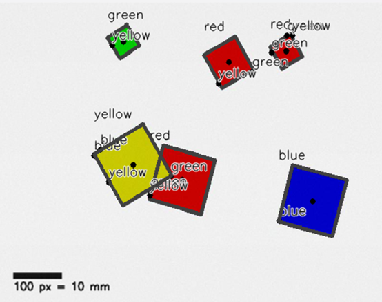
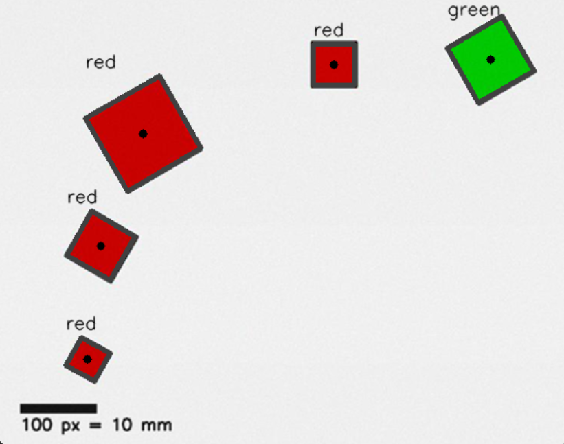
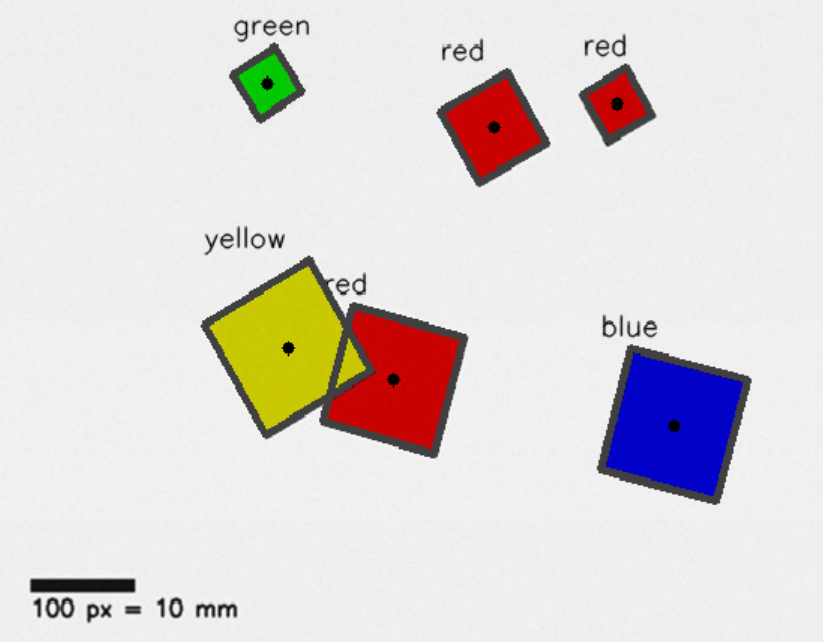
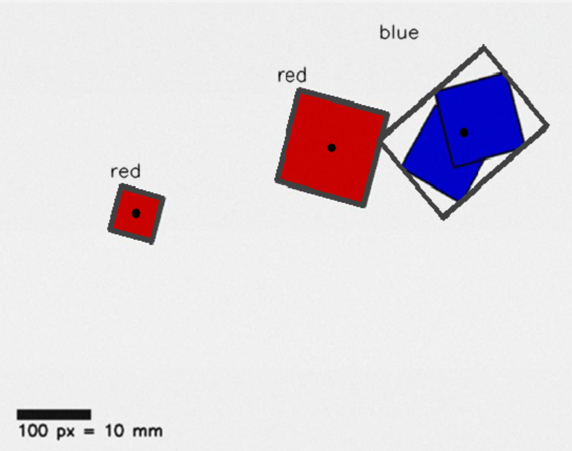

# <center>T3：彩色方块检测系统 - 技术文档</center>

## 目录：
- [一、题目分析](#题目分析)
- [二、设计思路](#设计思路)
- [三、算法设计](#算法设计)
- [四、迭代历程](#迭代历程)


## 题目分析
先来看题设的三张图，分别是：
- 1.非重叠独立方块
- 2.不同色重叠方块
- 3.同色重叠方块
  
我们的目标是识别其中所有的方块，获得其参数，实现以下功能：
- 多颜色目标检测（红、绿、蓝、黄）
- 旋转方块识别（支持任意角度）
- 几何信息提取（中心坐标、尺寸、角度）
- 可视化标注（检测框、中心点、颜色标签）
- 结果导出（图像文件、JSON 数据）

## 设计思路
由上，经过思考，我们可以得到如下的处理流程：
```
输入层: 图像文件 (PNG)
    ↓
预处理层: BGR → HSV 颜色空间转换，初始化参数
    ↓
检测层: 颜色阈值 → 掩码生成 → 轮廓提取
    ↓
分析层: 面积过滤 → 最小外接矩形计算 → 特征提取
    ↓
标注层: 绘制检测框 → 标注中心点 → 添加文字标签
    ↓
输出层: 保存图像 + JSON 数据 + 窗口显示
```

## 算法设计
接下来，我们就可以进行具体的算法设计了

### 1.输入层：
#### 1.1 图像加载模块
**功能：** 读取图像文件并进行错误检查
**设计：**
- 文件路径拼接：`"T3/Input/" + image_path`
- 错误处理：加载失败时输出错误信息并退出

### 2.预处理层：
#### 2.1 颜色空间选择：HSV
**设计理由：**
- HSV 鲁棒性强
- 色相（H）通道独立于亮度和饱和度，更适合颜色识别
- 相比 RGB，HSV 能更准确地定义颜色范围

**实现：**
```python
hsv = cv2.cvtColor(image, cv2.COLOR_BGR2HSV)
```

### 3.检测层与分析层
#### 3.1 颜色阈值设计
**设计思路：**
- 为每种颜色定义 HSV 上下限范围
- 红色特殊处理：HSV 中红色跨越 0°（0-10° 和 160-179°），需要两个范围合并

**实现：**
```python
color_ranges = {
    'red1': (np.array([0, 100, 100]), np.array([10, 255, 255])),
    'red2': (np.array([160, 100, 100]), np.array([179, 255, 255])),
    'green': (np.array([40, 60, 60]), np.array([85, 255, 255])),
    'blue': (np.array([90, 60, 60]), np.array([140, 255, 255])),
    'yellow': (np.array([15, 60, 60]), np.array([35, 255, 255]))
}
```

#### 3.2 掩码生成算法
**设计思路：**
- 使用 `cv2.inRange()` 生成二值掩码
- 红色需要合并两个掩码（`cv2.bitwise_or()`）
- 其他颜色直接生成单掩码

**优势：**
- 二值掩码便于后续轮廓提取
- 噪声抑制效果好

#### 3.3 轮廓检测与过滤
**设计思路：**
- 使用 `cv2.findContours()` 提取外部轮廓
- 面积过滤：面积 < 200 像素的轮廓视为噪声，直接跳过

**设计理由：**
- 过滤小面积噪声点
- 提高检测准确性
- 减少无效计算

#### 3.4 最小外接矩形算法
**设计思路：**
- 使用 `cv2.minAreaRect()` 计算最小面积旋转矩形
- 支持任意角度的方块检测
- 提取中心点、尺寸、角度信息

**优势：**
- 比普通边界框更精确
- 能处理旋转目标
- 提供角度信息

**特征提取：**
- 中心坐标：`(cx, cy)`
- 尺寸：`max(rw, rh)`（取较长边）
- 角度：四舍五入取整

### 4.标注层
#### 4.1 可视化标注模块
**功能：** 在原图上绘制检测结果
**设计：**
- 绘制旋转矩形边框（灰色，3像素）
- 绘制中心点（黑色实心圆，半径4像素）
- 标注颜色标签（黑色文字）

**标签位置计算：**
- 找到矩形左上角坐标
- 添加边界保护（左边界≥5，上边界≥15）
- 文字位置：矩形上方8像素

### 5.输出层
#### 5.1 数据存储模块
**功能：** 保存检测结果为 JSON 和图像文件
**设计：**
- JSON 格式：包含文件名、检测列表、颜色统计
- 图像格式：PNG，带标注信息
- 使用 UTF-8 编码

#### 5.2 窗口显示模块
**功能：** 显示检测结果窗口
**设计：**
- 使用 `try-except` 处理无 GUI 环境
- 可调整大小窗口（`WINDOW_NORMAL`）
- 等待用户按键后关闭

## 迭代历程
< 三、算法设计 > 中的模块是最终成果，这之中经历了多轮迭代过程

#### 迭代1：
仅有框架，无法实现图像的识别（识别到了整个图像作为一个大方块，令人忍俊不禁）

#### 迭代2：
调整了检测层，现在可以进行识别，但无法进行正确的标注（标注边框为正立的方形）
- 如图（这张图我当时没有截，是后期画图模拟的，非常抱歉）：


#### 迭代3：
调整了检测层，现在可以正常的标注边框

#### 迭代4：
增加了标注层内容，现在可以进行参数标注，但由于检测层未进行过滤，出现了错误识别
- 如图：


#### 迭代5：
调整了检测层，增加了面积计算功能，对面积过小的“杂音”图片不予处理

#### 迭代6：
完善标注模块并删除冗余代码，基本实现图1和图2的识别
- 如图：



但图三存在问题：无法识别同色重叠方块
- 如图：



