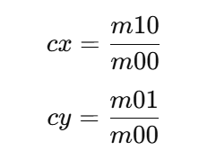

在计算机视觉中，**计算重心**（Centroid）是指一个物体的几何中心，通常通过物体的**轮廓**（或边界）来计算。**重心**是物体质量分布的“中心”，在二维图像中，通常被表示为图像或物体轮廓的**平均位置**。

在你提到的算法部分，计算重心的步骤是通过 **轮廓的矩**（Moment）来完成的。具体来说，这部分算法的逻辑是基于 **图像矩** 和 **轮廓的中心位置** 来计算重心。

### 具体的算法逻辑：

1. **轮廓的矩（Moment）**：

   * 在计算重心之前，首先需要通过 **cv2.moments** 函数计算图像或轮廓的矩。矩是图像的数学属性，能够描述图像中的几何特征，如面积、中心、方向等。
   * **图像矩** 中的 `m00` 表示图像的**总面积**，即所有像素值的总和。通过 `m10` 和 `m01` 可以得到物体重心的坐标。

2. **计算重心**：

   * 根据图像矩中的 `m10` 和 `m01`，可以通过如下公式计算重心的坐标 `(cx, cy)`：
    
   * 其中：

     * `m10` 是关于 x 轴的矩，表示所有像素点的 x 坐标值与像素值的加权和。
     * `m01` 是关于 y 轴的矩，表示所有像素点的 y 坐标值与像素值的加权和。
     * `m00` 是图像的面积（或者说是轮廓包含的像素总数）。

3. **逻辑解释**：

   * **步骤 1**：首先通过 `cv2.findContours()` 函数获取图像中的轮廓。
   * **步骤 2**：选择其中一个轮廓（通常是面积最大或者最符合需求的轮廓），然后使用 `cv2.moments()` 计算该轮廓的矩。
   * **步骤 3**：如果矩 `m00` 大于 0（表示该轮廓有效且不为空），使用 `m10` 和 `m01` 来计算轮廓的重心坐标 `(cx, cy)`。
   * **步骤 4**：将计算得到的 `(cx, cy)` 存储为重心位置，并返回该值。

### 算法逻辑在代码中的实现：

```python
M = cv2.moments(largest)
if M['m00'] > 0:
    cx = int(M['m10'] / M['m00'])
    cy = int(M['m01'] / M['m00'])
    features['centroid'] = (cx, cy)
```

* **`cv2.moments(largest)`**：计算轮廓 `largest` 的矩（包括 `m00`、`m10`、`m01` 等）。
* **`M['m00']`**：检查轮廓的面积（矩 `m00`）。如果 `m00` 为 0，说明轮廓没有面积（即无效轮廓），就跳过计算。
* **`cx = int(M['m10'] / M['m00'])` 和 `cy = int(M['m01'] / M['m00'])`**：通过矩计算轮廓的重心坐标 `cx` 和 `cy`。
* **`features['centroid'] = (cx, cy)`**：将计算出来的重心坐标保存到特征字典 `features` 中。

### 总结：

* **重心计算的意义**：重心是图形的一个重要特征，常常用于确定物体的位置，进行物体追踪、形状匹配等任务。通过计算图像或轮廓的重心，我们可以准确地知道物体的中心位置，这对于后续的分析（如物体移动检测、物体分类等）非常重要。
